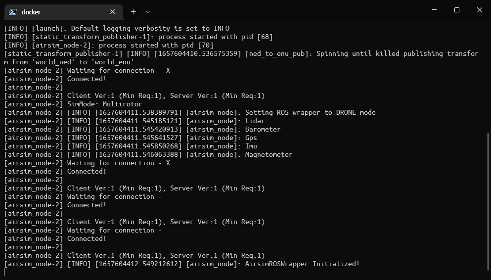
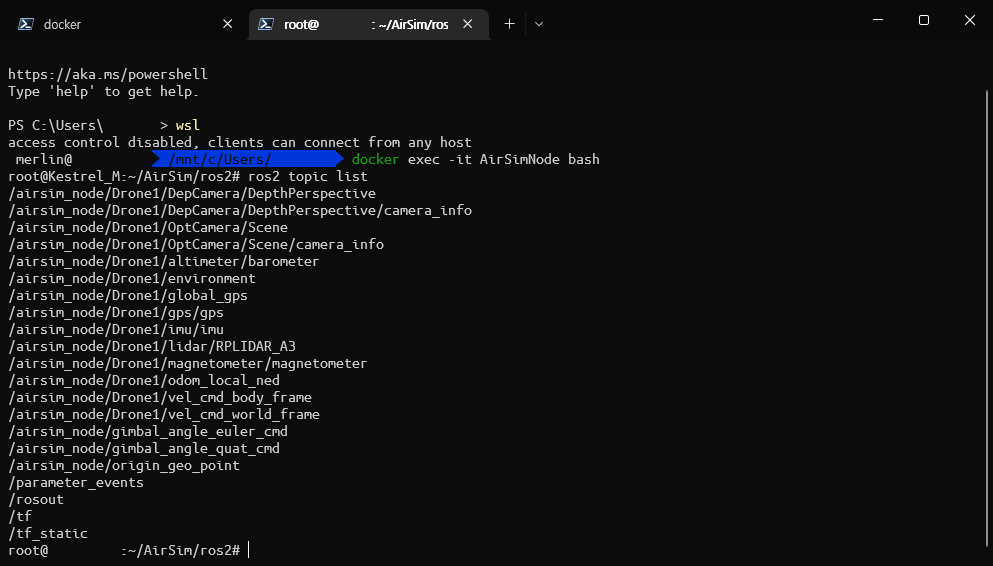

# AirSim ROS2 container

- Linux Container which includes [airsim_ros_pkgs](https://github.com/microsoft/AirSim/tree/main/ros2/src/airsim_ros_pkgs)
- Includes minimum components to run ROS2 node
    - Only includes built `AirLib`, `MavLinkCom`, `cmake`, `external`, `ros2` from [AirSim](https://github.com/microsoft/AirSim)
- Targets ROS2 node container to subscribe/publish AirSim msgs from local/external AirSim instance

## 1. Building Container

- Container can be built with following command:
    - Uses `DOCKER_BUILDKIT` for implementing docker [multi-stage builds](https://docs.docker.com/develop/develop-images/multistage-build/)

```shell
DOCKER_BUILDKIT=1 \
docker build --no-cache \
-t kestr31/airsim-ros2:<tag> .
```

## 2. Running Container

### 2.1 Environment Variables

- List of environments variable used in this container are as following:

|VARIABLE NAME|DECRIPTION|DEFAULT VALUE|EXAMPLE|
|:-|:-|:-|:-|
|rebuild|Rebuild ROS2 package on startup or not|false|`-e rebuild=true`|
|simhost|AirSim host address (IPV4)|localhost|`-e simhost=172.19.56.1`|

- `rebuild` exists for future work (Automated build of user defined ROS2 package). For now, changing it is not required.
- For use in WSL, `simhost` is obtainable by `ip route` command (Windows host IP address)
    - However, due to Windows firewall, AirSim on Windows host is inaccessible from WSL environment
    - Disable firewall or add special inbound rule in Windows firewall. Check [WSL2-network-tools](https://github.com/kestr31/WSL2-network-tools) for more info.

### 2.2 Options

- [Attach container to host network](https://docs.docker.com/network/host/) by `--net host`. This must be done for easy use.
- Other options are not necessary. Set them based on your need.

### 2.3 Run Command

- As a result, minimum command for running this container is as following:
    - If you need, you can use [docker-compose](https://docs.docker.com/compose/) to deploy this with AirSim binary container

```shell
docker run -it --rm \
    -e simhost=localhost \
    --net host \
    kestr3l/airsim-ros2:<tag>
```

### 2.4 Example

1. Run AirSim on Windows with provided `settings.json`
2. Disable firewall for `Guest or public networks` or generate firewall rule using [WSL2-network-tools](https://github.com/kestr31/WSL2-network-tools)
    - **Strongly recommend latter solution since disabling firewall is extremely dangerous**
    - Step 3 is based on assumption that you successfully assigned Windows host IP to `$winhost` variable
3. Run container with following command:
    - This example uses [`kestr3l/airsim-ros2:galactic-run-0.0.1`](https://hub.docker.com/r/kestr3l/airsim-ros2/tags)
    - For easy access, assign container's name as `AirSimNode`

```shell
docker run -it --rm \
    -e simhost=winhost \
    --net host \
    --name AirSimNode \
    kestr3l/airsim-ros2:galactic-run-0.0.1
```

4. You can see following messages if all went well



5. Check published messages

```shell
docker exec -it AirSimNode bash
ros2 topic list
```



## 3. To-Do List

- `dev` version of image which contains all components of AirSim
- `bin` version of image which contains AirSim environment binary
- Script to build and run any user defined ROS2 package along with default package
- Description for subscribing messages published from this container on external network/container

## 4. Reference

- [microsoft/AirSim/ros2/src](https://github.com/microsoft/AirSim/tree/main/ros2/src) (AirSim ROS2 package)
- [accetto/ubuntu-vnc-xfce](https://github.com/accetto/ubuntu-vnc-xfce) (Multi-Stage Build)
- [How to connect wsl to a windows localhost?](https://superuser.com/questions/1535269/how-to-connect-wsl-to-a-windows-localhost) (WSL2 Windows localhost access)